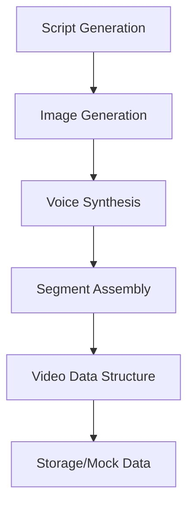
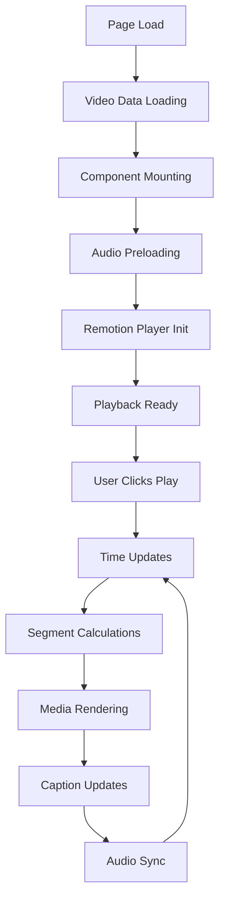
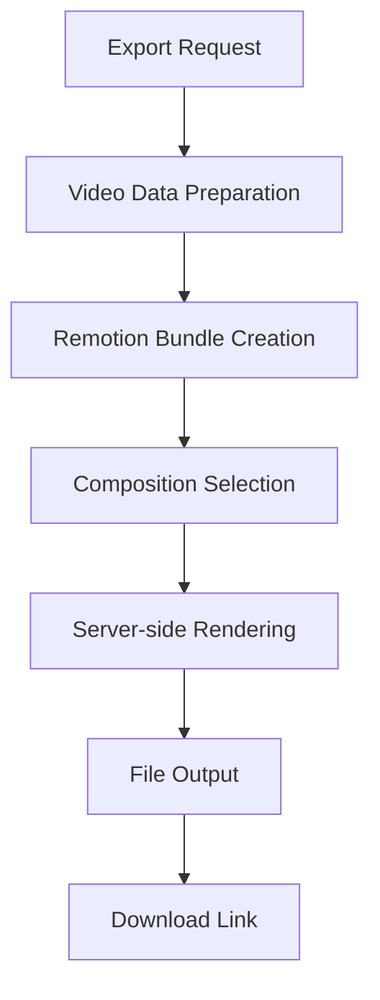

# Video Architecture & Component Wiring Documentation

## Overview

This document provides a comprehensive overview of how the video rendering system works in the AI Shorts application, including component wiring, data flow, and the integration between Next.js, Remotion, and custom video components.

## System Architecture

The video system follows a modular architecture with clear separation between:

1. **Data Layer**: Video data models and storage
2. **Composition Layer**: Remotion video compositions
3. **Player Layer**: Video playback and controls
4. **Export Layer**: Server-side video rendering and export

## Core Data Models

### Video Data Structure (`src/types/video.ts`)

The system is built around a comprehensive video data model:

```typescript
interface Video {
  _id: string;
  segments: VideoSegment[];      // Individual video segments
  layers: Layer[];              // Audio and caption layers
  format: MediaFormat;          // Video dimensions (1080x1920)
  // ... other metadata
}

interface VideoSegment {
  text: string;                 // Script text for this segment
  imagePrompt: string;          // AI prompt for image generation
  imageUrl: string;            // Generated/selected media URL
  audioUrl: string;            // Generated voice audio
  duration: number;            // Segment duration in seconds
  wordTimings: WordTiming[];   // Word-level timing for captions
  media: MediaItem[];          // Media elements and effects
  overlay?: Overlay;           // Optional video overlay
  // ... other properties
}
```

## Component Architecture

### 1. Root Composition (`src/Root.tsx`)

**Purpose**: Entry point for Remotion rendering
**Location**: `src/Root.tsx:11`

```typescript
export const RemotionRoot: React.FC = () => {
  const totalFrames = Math.round(totalDurationInSeconds * 30); // 30 fps
  
  return (
    <Composition
      id="VideoComposition"
      component={VideoCompositionWrapper}
      durationInFrames={totalFrames}
      fps={30}
      width={VIDEO_DATA.video.format.width}
      height={VIDEO_DATA.video.format.height}
      defaultProps={{
        video: VIDEO_DATA.video,
      }}
    />
  );
};
```

**Key Features**:
- Calculates total video duration from all segments
- Sets up Remotion composition with 30fps, 1080x1920 format
- Passes video data as props to the main composition

### 2. Main Video Composition (`src/components/video-editor/video-composition.tsx`)

**Purpose**: Core Remotion composition that orchestrates all video elements
**Location**: `src/components/video-editor/video-composition.tsx:21`

```typescript
export const VideoComposition: React.FC<VideoCompositionProps> = ({
  video,
}) => {
  const { getCurrentSegmentAndTime, getSegmentsToRender, fps } = useSegmentTiming(video);
  const { getCaptionStyle, getCurrentWordsData } = useCaptionData(video, activeSegment, relativeTime);

  return (
    <AbsoluteFill style={{ backgroundColor: "#1a1a1a" }}>
      {/* Video Segments */}
      <VideoSegmentRenderer
        segmentsToRender={segmentsToRender}
        fps={fps}
        segments={video.segments}
      />
      
      {/* Dynamic Captions */}
      <DynamicCaptions
        words={words}
        displayText={displayText}
        captionStyle={captionStyle}
      />
      
      {/* Watermark */}
      <VideoWatermark show={!!video.watermark} />
    </AbsoluteFill>
  );
};
```

**Key Features**:
- Uses custom hooks for segment timing and caption data
- Renders video segments, captions, and watermark
- Manages timing synchronization across all elements

### 3. Segment Timing Hook (`src/components/video-editor/hooks/use-segment-timing.ts`)

**Purpose**: Manages timing calculations for video segments
**Location**: `src/components/video-editor/hooks/use-segment-timing.ts:4`

```typescript
export const useSegmentTiming = (video: Video) => {
  const frame = useCurrentFrame();
  const { fps } = useVideoConfig();

  const getCurrentSegmentAndTime = () => {
    let cumulativeFrames = 0;
    for (const segment of video.segments) {
      const segmentFrames = Math.round(segment.duration * fps);
      const segmentEndFrame = cumulativeFrames + segmentFrames;
      
      if (frame >= cumulativeFrames && frame < segmentEndFrame) {
        const relativeTime = (frame - cumulativeFrames) / fps;
        return { segment, relativeTime, cumulativeFrames, segmentFrames };
      }
      cumulativeFrames = segmentEndFrame;
    }
    // Return last segment if frame is past all segments
  };

  const getSegmentsToRender = () => {
    // Optimization: Only render current segment ±1 adjacent segments
    const windowSize = 1;
    // ... windowing logic
  };
};
```

**Key Features**:
- Converts frame numbers to segment-relative timing
- Optimizes rendering by windowing visible segments
- Provides accurate timing for caption synchronization

### 4. Video Segment Renderer (`src/components/video-editor/video-segment-renderer.tsx`)

**Purpose**: Renders individual video segments with media and effects
**Location**: `src/components/video-editor/video-segment-renderer.tsx:21`

```typescript
export const VideoSegmentRenderer: React.FC<VideoSegmentRendererProps> = ({
  segmentsToRender,
  fps,
  segments,
}) => {
  return (
    <>
      {segmentsToRender.map(({ segment, originalIndex }) => (
        <SegmentComponent
          key={segment._id}
          segment={segment}
          originalIndex={originalIndex}
          fps={fps}
          segments={segments}
        />
      ))}
    </>
  );
};
```

Each segment component handles:
- **Media Rendering**: Images, videos with effects (scale, blur, etc.)
- **Overlay Effects**: Video overlays with blend modes
- **Fallback Backgrounds**: Gradient backgrounds when no media
- **Animation Effects**: Subtle scale animations

### 5. Dynamic Captions (`src/components/video-editor/dynamic-captions.tsx`)

**Purpose**: Renders word-by-word synchronized captions
**Location**: `src/components/video-editor/dynamic-captions.tsx:30`

```typescript
export const DynamicCaptions: React.FC<DynamicCaptionsProps> = ({
  words,
  displayText,
  captionStyle,
}) => {
  return (
    <AbsoluteFill style={{ /* positioning */ }}>
      <CaptionContainer captionStyle={captionStyle}>
        {words.length > 0 ? (
          <WordRenderer words={words} captionStyle={captionStyle} />
        ) : (
          <span>{displayText}</span>
        )}
      </CaptionContainer>
    </AbsoluteFill>
  );
};
```

**Caption Features**:
- **Word-level highlighting**: Active words get different colors/effects
- **Batch display**: Shows 2-3 words at a time based on `wordsPerBatch`
- **Style customization**: Font, colors, shadows, positioning
- **Smooth transitions**: Active word highlighting with glow effects

### 6. Caption Data Hook (`src/components/video-editor/hooks/use-caption-data.ts`)

**Purpose**: Manages caption timing and word highlighting logic
**Location**: `src/components/video-editor/hooks/use-caption-data.ts:23`

```typescript
export const useCaptionData = (video: Video, activeSegment: VideoSegment, relativeTime: number) => {
  const getCurrentWordsData = (captionStyle: CaptionStyle) => {
    // Process word timings to determine active/completed states
    for (const word of allWords) {
      const wordActive = relativeTime >= word.start && relativeTime <= word.end;
      const wordCompleted = relativeTime > word.end;
      
      wordsData.push({
        text: word.text,
        isActive: wordActive,
        isCompleted: wordCompleted,
      });
    }

    // Build display based on wordsPerBatch setting
    const wordsPerBatch = captionStyle.wordsPerBatch || 3;
    // ... batching logic
  };
};
```

**Key Features**:
- Processes word-level timing data from TTS
- Determines active/completed word states
- Implements batched word display
- Handles edge cases (no timing data, word overlaps)

## Player Architecture

### 7. Video Player Panel (`src/components/video-editor/video-player-panel.tsx`)

**Purpose**: Main video player interface with controls
**Location**: `src/components/video-editor/video-player-panel.tsx:29`

```typescript
export function VideoPlayerPanel({
  video,
  isPlaying,
  onPlayPause,
  currentTime,
  onTimeUpdate,
  // ... other props
}) {
  const playerRef = useRef<any>(null);
  
  return (
    <div className="flex h-full w-full flex-1 flex-col">
      {/* External Audio Player */}
      <ExternalAudioPlayer
        segments={video.segments}
        isPlaying={isPlaying}
        currentTime={currentTime}
        backgroundMusicUrl="/demo/temporex.mp3"
      />
      
      {/* Remotion Player */}
      <Player
        ref={playerRef}
        component={VideoComposition}
        durationInFrames={totalFrames}
        compositionWidth={video.format.width}
        compositionHeight={video.format.height}
        inputProps={{ video }}
        controls={false}
        showVolumeControls={false}
        autoPlay={false}
      />
      
      {/* Custom Controls */}
      {/* Progress bar, play/pause, volume, etc. */}
    </div>
  );
}
```

**Key Features**:
- **Remotion Player Integration**: Uses `@remotion/player` for video rendering
- **External Audio**: Separate audio management for better sync control
- **Custom Controls**: Play/pause, progress, volume, fullscreen
- **Timeline Sync**: Synchronizes player time with external audio

### 8. External Audio Player (`src/components/video-editor/external-audio-player.tsx`)

**Purpose**: Manages all audio playback (voice + background music)
**Location**: `src/components/video-editor/external-audio-player.tsx:16`

```typescript
export function ExternalAudioPlayer({
  segments,
  isPlaying,
  currentTime,
  backgroundMusicUrl,
  volume,
  isMuted,
}) {
  const backgroundMusicRef = useRef<HTMLAudioElement | null>(null);
  const voiceAudioRefs = useRef<Map<string, HTMLAudioElement>>(new Map());
  const currentVoiceRef = useRef<HTMLAudioElement | null>(null);

  // Audio ducking constants
  const BACKGROUND_MUSIC_NORMAL = 0.4;
  const BACKGROUND_MUSIC_DUCKED = 0.15;  // Lower during voice
  const VOICE_VOLUME = 0.85;

  // Handle segment changes and audio switching
  useEffect(() => {
    const currentSegmentIndex = getCurrentSegmentIndex();
    const segment = segments[currentSegmentIndex];
    
    if (segment?.audioUrl) {
      const voiceAudio = voiceAudioRefs.current.get(segment._id);
      
      // Switch to new voice segment
      if (currentVoiceRef.current !== voiceAudio) {
        // Duck background music
        smoothVolumeTransition(
          backgroundMusicRef.current,
          volume * BACKGROUND_MUSIC_DUCKED,
          200
        );
        
        // Start voice audio
        voiceAudio.play();
      }
    }
  }, [currentTime, segments, isPlaying]);
}
```

**Audio Management Features**:
- **Preloading**: All audio files preloaded for smooth playback
- **Audio Ducking**: Background music volume reduces during voice
- **Smooth Transitions**: Volume fades to prevent audio pops
- **Synchronization**: Precise timing sync with video segments
- **Cross-Origin Support**: Handles CORS for external audio files

## Video Export System

### 9. Export API Route (`src/app/api/export-video/route.ts`)

**Purpose**: Server-side video rendering and export
**Location**: `src/app/api/export-video/route.ts:6`

```typescript
export async function POST(req: NextRequest) {
  const { videoData, quality = "medium" } = await req.json();

  // Dynamic import of Remotion modules
  const { bundle, renderMedia, selectComposition } = await import('@remotion/renderer');

  // Bundle the Remotion video
  const bundleLocation = await bundle({
    entryPoint: path.resolve("src/Root.tsx"),
    webpackOverride: (config) => ({
      ...config,
      resolve: {
        ...config.resolve,
        alias: { "@": path.resolve(process.cwd(), "src") }
      }
    })
  });

  // Render the video
  await renderMedia({
    composition: compositions,
    serveUrl: bundleLocation,
    codec: "h264",
    outputLocation: fullOutputPath,
    inputProps: { video: videoData },
    crf: settings.crf,
    pixelFormat: "yuv420p",
    muted: true, // Audio handled externally
  });

  return NextResponse.json({
    success: true,
    downloadUrl: `/exports/${filename}`,
  });
}
```

**Export Features**:
- **Server-side Rendering**: Uses Remotion renderer on the server
- **Quality Settings**: Low/Medium/High quality options
- **Bundle Creation**: Webpack bundling for Remotion composition
- **File Management**: Outputs to public/exports directory
- **Error Handling**: Comprehensive error reporting

## Data Flow

### 1. Video Creation Flow



1. **Script Generation**: AI generates script text via OpenAI API
2. **Image Generation**: Creates images from prompts using AI services
3. **Voice Synthesis**: Converts text to speech with word timings
4. **Segment Assembly**: Combines text, images, audio into segments
5. **Data Structure**: Assembles into complete Video object
6. **Storage**: Saves to database or uses mock data for development

### 2. Video Playback Flow



**Detailed Flow**:

1. **Video Data Loading** (`src/app/(home)/video/[id]/page.tsx:286`):
   - Loads from ProjectStorage or falls back to mock data
   - Converts ProjectData format to VideoGenerationData

2. **Component Mounting**:
   - VideoPlayerPanel initializes Remotion Player
   - ExternalAudioPlayer preloads all audio files
   - VideoComposition prepares for rendering

3. **Playbook Loop** (30fps):
   - `useCurrentFrame()` provides current frame number
   - `useSegmentTiming` calculates current segment and relative time
   - `VideoSegmentRenderer` renders appropriate media
   - `useCaptionData` determines active words
   - `DynamicCaptions` highlights current words
   - `ExternalAudioPlayer` manages audio playback and ducking

### 3. Export Flow



1. **Export Request**: User clicks export with quality setting
2. **Data Preparation**: Video data serialized for server processing
3. **Bundle Creation**: Webpack bundles React components for server
4. **Rendering**: Remotion renders video frame-by-frame
5. **Output**: MP4 file created in public/exports
6. **Download**: Client receives download URL

## Performance Optimizations

### 1. Segment Windowing (`use-segment-timing.ts:35`)

Only renders current segment ±1 adjacent segments to improve performance:

```typescript
const getSegmentsToRender = () => {
  const windowSize = 1;
  const startIndex = Math.max(0, currentSegmentIndex - windowSize);
  const endIndex = Math.min(segments.length - 1, currentSegmentIndex + windowSize);
  
  return segments.slice(startIndex, endIndex + 1)
    .map((segment, relativeIndex) => ({
      segment,
      originalIndex: startIndex + relativeIndex,
    }));
};
```

### 2. Audio Preloading and Management

- All audio files preloaded on component mount
- Smooth volume transitions prevent audio artifacts
- Audio ducking for professional mixing
- Precise synchronization with video timeline

### 3. Caption Batching

Shows only 2-3 words at a time based on `wordsPerBatch` setting:

```typescript
const wordsPerBatch = captionStyle.wordsPerBatch || 3;
const activeWordIndex = wordsData.findIndex((w) => w.isActive);

if (activeWordIndex >= 0) {
  const startIndex = Math.max(0, activeWordIndex - Math.floor(wordsPerBatch / 2));
  const endIndex = Math.min(wordsData.length, startIndex + wordsPerBatch);
  displayWords = wordsData.slice(startIndex, endIndex);
}
```

## Key Integrations

### 1. Remotion Integration

- **@remotion/player**: Client-side video playback
- **@remotion/renderer**: Server-side video export
- **@remotion/bundler**: Webpack bundling for server rendering

### 2. Next.js Integration

- App Router structure with dynamic routes (`/video/[id]`)
- API routes for video export
- Server-side rendering capabilities
- Static asset serving from public directory

### 3. Audio Integration

- HTML5 Audio API for precise audio control
- Web Audio API considerations for advanced features
- Cross-origin resource sharing (CORS) handling
- Browser audio policy compliance

## Configuration Files

### Remotion Config (`remotion.config.ts`)

```typescript
const config = {
  videoImageFormat: "jpeg" as const,
  overwriteOutput: true,
  pixelFormat: "yuv420p" as const,
  codec: "h264" as const,
  crf: 18,
  imageSequence: false,
};
```

### TypeScript Configuration

- Path aliases (`@/*` -> `src/*`) for clean imports
- Strict type checking for video data structures
- Remotion-specific type definitions

## Troubleshooting Common Issues

### 1. Audio Sync Issues

- Check segment duration calculations
- Verify word timing data accuracy
- Ensure audio file formats are supported
- Test cross-origin audio loading

### 2. Video Export Failures

- Verify Remotion dependencies are installed
- Check server memory limits for large videos
- Ensure proper webpack configuration
- Validate video data structure

### 3. Performance Issues

- Monitor segment windowing effectiveness
- Check for memory leaks in audio management
- Optimize image/video file sizes
- Consider lazy loading strategies

## Future Enhancements

1. **Real-time Collaboration**: Multi-user editing capabilities
2. **Advanced Effects**: More video transitions and effects
3. **Audio Waveform Visualization**: Visual audio editing
4. **Template System**: Pre-built video templates
5. **Cloud Rendering**: Distributed video processing
6. **Mobile Support**: Touch-friendly video editing

---

This architecture provides a scalable foundation for AI-powered video creation with precise audio-visual synchronization and professional-quality output.